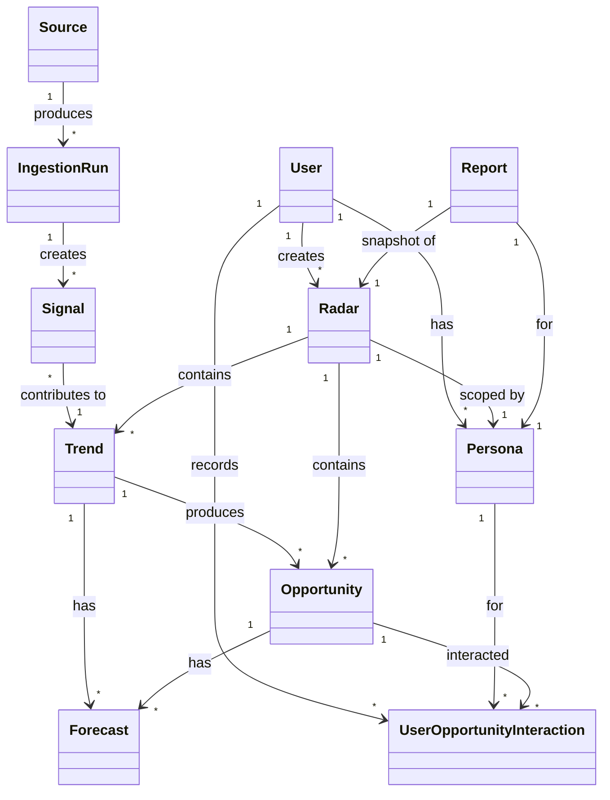
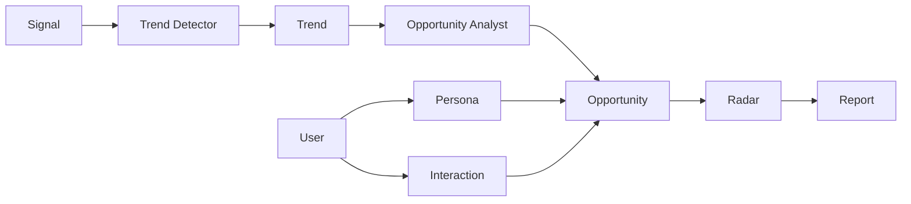
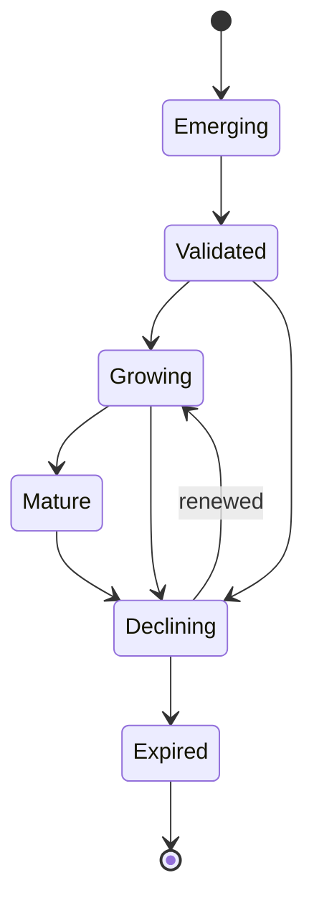

# ODE — Domain Model v2.0

## Core Principles

1. **Opportunity is the core asset.** Everything in ODE exists to produce, score, and deliver Opportunities.
2. **Signal, Trend, Opportunity is a strict lifecycle.** A Signal does not become an Opportunity without validation.
3. **LLMs explain; data scores.** Scoring is deterministic and reproducible. LLMs narrate and translate only.
4. **Personas shape relevance.** The same Opportunity means different things to different decision-makers.
5. **Immutability and traceability.** Signals and Reports are immutable. Every derived artifact references its source.

## Ubiquitous Language

| Term | Definition |
|---|---|
| **User** | An authenticated person using ODE. |
| **Persona** | A reusable decision profile that defines what kinds of opportunities a User cares about. |
| **Domain** | A broad category of intelligence, e.g., Technology, Careers, Startups, Healthcare. |
| **Query Focus** | A specific area a User selects within a Domain, e.g., AI Engineering. |
| **Source** | A configured external feed that produces Signals, e.g., GitHub API, Hacker News. |
| **IngestionRun** | A single execution that fetches from a Source and creates zero or more Signals. |
| **Signal** | An immutable, timestamped observation from a Source about a specific entity and metric. |
| **Trend** | A persistent pattern formed from correlated Signals over a time window. |
| **Opportunity** | A validated, scored, actionable possibility derived from a Trend and evaluated against a Persona. |
| **Forecast** | A deterministic projection attached to a Trend or Opportunity, used for planning only. |
| **Radar** | A saved, continuously refreshed query specification over Trends and Opportunities. |
| **Report** | A static snapshot of a Radar's contents, formatted for reading and export. |
| **UserOpportunityInteraction** | A per-User, per-Persona, per-Opportunity record of an action and optional notes. |

## Core Entities

### User

A person who can authenticate, create Personas, view Radars, and act on Opportunities.

- `userId`
- `email`
- `createdAt`
- `updatedAt`

### Persona

A reusable decision profile. Persona Fit is no longer part of the core
opportunity score; it should only be used when real user-profile data is
available.

- `personaId`
- `userId`
- `name`
- `goals`
- `interests`
- `industryPreferences`
- `riskAppetite`
- `preferredHorizon`
- `geography`
- `capitalAvailability`
- `skillProfile`

### Source

A configured external feed with metadata and a trust tier.

- `sourceId`
- `name`
- `sourceType`
- `trustTier`
- `refreshFrequency`
- `endpoint`
- `owner`
- `status` — Active, Degraded, Failing, Disabled
- `metadata`

### IngestionRun

A single execution that fetched data from a Source and emitted Signals.

- `runId`
- `sourceId`
- `startTime`
- `endTime`
- `status`
- `signalsCreated`
- `errors`
- `metadata`

### Signal

An immutable, timestamped observation.

- `signalId`
- `sourceId`
- `ingestionRunId`
- `sourceType`
- `entity`
- `metric`
- `value`
- `unit`
- `timestamp`
- `ingestDate`
- `rawPayload`
- `normalizedPayload`
- `evidenceQuality`
- `confidence`
- `tags`

### Trend

A persistent pattern derived from correlated Signals.

- `trendId`
- `entity`
- `metric`
- `signals` (references)
- `startDate`
- `lastUpdatedDate`
- `endDate` (optional)
- `status` — Active, Dormant, Ended
- `momentum`
- `signalVolume`
- `evidenceQuality`
- `growthVelocity`

### Opportunity

A scored, actionable possibility.

- `opportunityId`
- `trendId` (reference)
- `title`
- `description`
- `whyNow`
- `whoBenefits`
- `recommendedAction`
- `supportingEvidence`
- `score` — 0 to 100
- `scoreComponents`
- `lifecycleState` — Emerging, Validated, Growing, Mature, Declining, Expired
- `emergedDate`
- `validUntil`
- `lastScoreDate`

### Forecast

A deterministic projection attached to a Trend or Opportunity.

- `forecastId`
- `targetType` — Trend or Opportunity
- `targetId`
- `createdAt`
- `horizon`
- `confidence`
- `modelVersion`
- `predictions`

### Radar

A saved query over Opportunities and Trends.

- `radarId`
- `name`
- `domains`
- `entities`
- `metrics`
- `tags`
- `personaId` (optional)
- `sortStrategy`
- `filters`

### Report

A static snapshot generated from a Radar.

- `reportId`
- `radarId`
- `userId`
- `personaId`
- `createdAt`
- `format` — Markdown, HTML, PDF
- `content`
- `sections`

### UserOpportunityInteraction

A record of a User's action on an Opportunity for a specific Persona.

- `interactionId`
- `userId`
- `personaId`
- `opportunityId`
- `action` — Saved, Watching, Dismissed, ActedOn, Archived
- `notes`
- `createdAt`
- `updatedAt`

## Entity Relationship Diagram

## Signal-to-Opportunity Lifecycle

## Opportunity Lifecycle

## Opportunity Score Components

| Component | Range | Meaning |
|---|---|---|
| **Evidence Quality** | 0–35 | Weighted average trust and authority of contributing Signals. |
| **Momentum** | 0–30 | How strongly the underlying metric is growing. |
| **Adoption** | 0–15 | Ecosystem presence, proxied by signal volume. |
| **Growth** | 0–10 | Acceleration of the growth rate. |
| **Relevance** | 0–10 | Alignment with the user's stated intent. |

Total: **0–100**

Persona Fit is intentionally excluded. Without explicit user-profile data it
adds noise and can make strong recommendations look arbitrary.

Time decay is applied as a freshness factor when the freshest Signal is older than a configured threshold.

## Radar Query Specification

A Radar is defined by:

- `domains` — broad category filters
- `entities` — specific things to watch
- `metrics` — signal metrics to consider
- `tags` — thematic tags
- `personaId` — optional Persona for scoring
- `sortStrategy` — e.g., Opportunity Score, Growth Velocity, Newest
- `filters` — score thresholds, date ranges, lifecycle states

## Key Invariants

1. A Signal is immutable once created.
2. A Trend is created by algorithmic clustering, not by an LLM.
3. An Opportunity is created only when a Trend is validated, scores above threshold, and has an explainable recommendation.
4. A Forecast never affects the current Opportunity Score.
5. A Report is a snapshot. Reports are not mutated after creation.
6. User actions live on an Interaction, not on the Opportunity itself.
